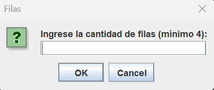
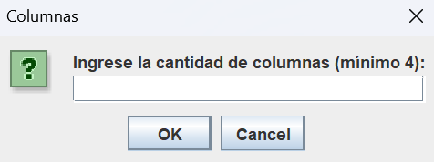
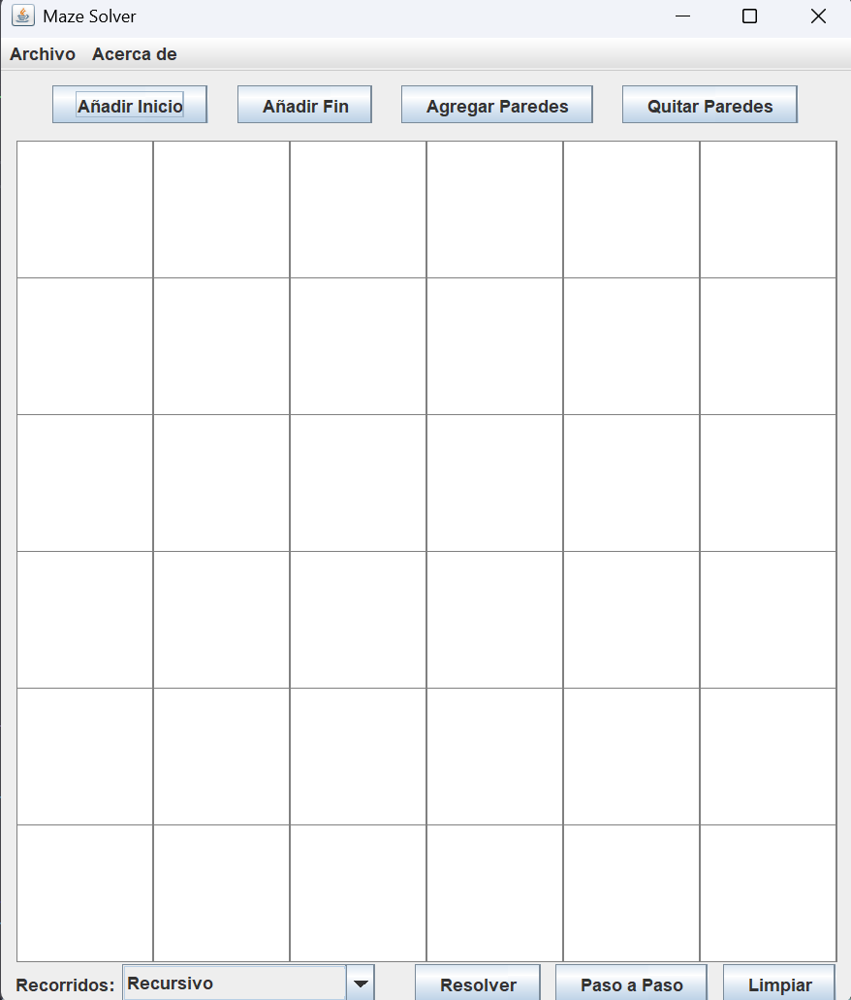
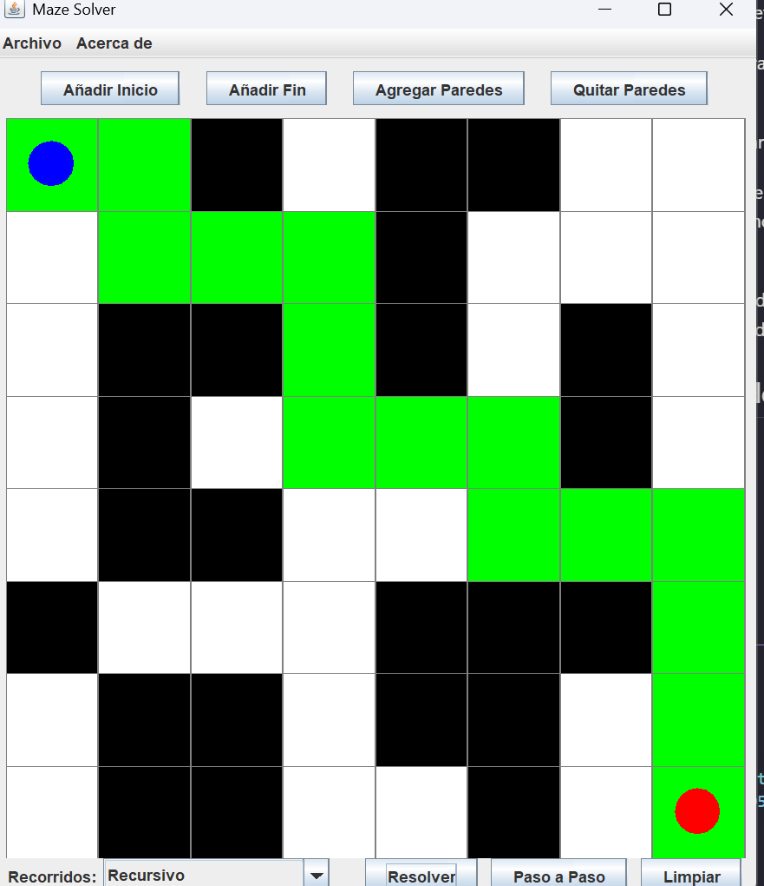
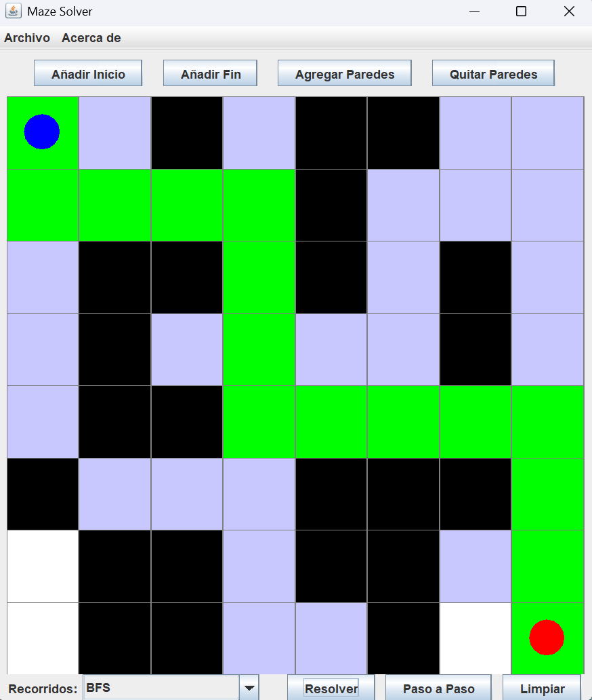
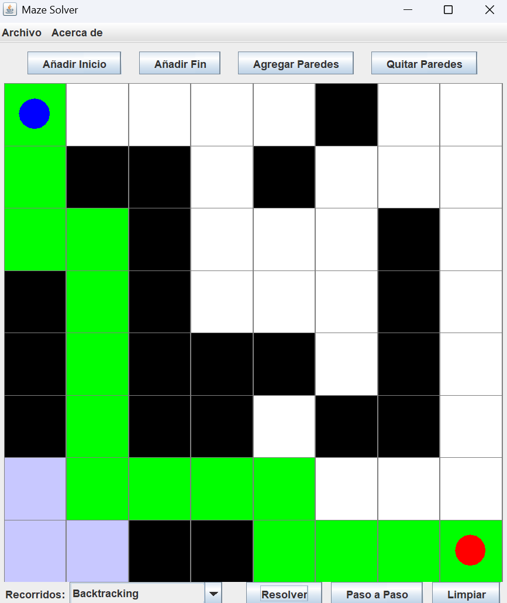
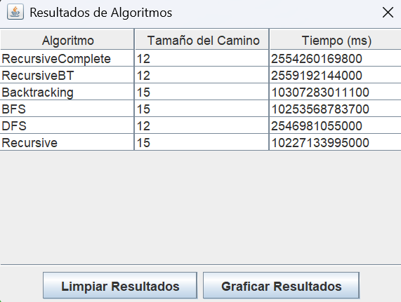
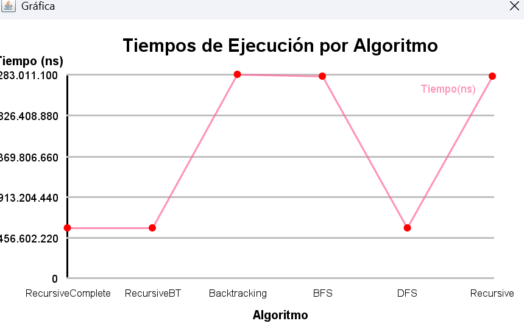
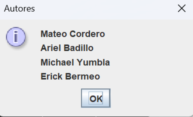

# Proyecto Final: Solucionador de Laberintos 

## 📌 Información General
- **Título:** Comparativa para Resolver Laberintos  
- **Asignatura:** Estructura de Datos  
- **Carrera:** Computación  
- **Integrantes:** Michael Yumbla, Erick Bermeo, Mateo Cordero, Ariel Badillo  
- **Fecha:** 28/07/2025  
- **Profesor:** Ing. Pablo Torres  

---
## ✨ Introducción

Resolver laberintos puede parecer algo simple, pero detrás de eso hay algoritmos bastante interesantes que aplican estructuras de datos como pilas, colas o recursión. En este proyecto quisimos experimentar con varias formas de solucionar laberintos, implementando desde métodos básicos hasta técnicas más completas con visualización paso a paso. Todo esto lo llevamos a una interfaz gráfica que permite observar el comportamiento de cada algoritmo en tiempo real, facilitando así la comparación de su rendimiento y lógica.

---

## 🎯 Objetivo

El objetivo principal fue desarrollar un solucionador de laberintos que permitiera comparar diferentes algoritmos aplicados al mismo problema. Además de resolver el laberinto, queríamos que el sistema mostrara visualmente cómo trabaja cada método, ayudando a entender conceptos como backtracking, BFS, DFS, y optimización. A través de esta aplicación, también buscamos reforzar conocimientos prácticos en Java, manejo de estructuras de datos, diseño de interfaces gráficas y organización de proyectos en equipo.

---
## 🧩 Descripción 

Implementación de 6 algoritmos con diferentes enfoques para resolver laberintos en Java, con visualización paso a paso en una interfaz gráfica.

### 1. MazeSolverRecursivo (Simple)
- **Tipo:** DFS Recursivo básico  
- **Características:**
  - Solo explora derecha y abajo  
  - Sin retroceso visible  
  - Eficiente en memoria  

### 2. MazeSolverRecursivoCompleto
- **Tipo:** DFS Recursivo completo  
- **Características:**
  - Explora en las 4 direcciones (arriba, abajo, izquierda, derecha)  
  - Muestra recorrido en **amarillo**  
  - Camino final correcto en **verde**

### 3. MazeSolverRecursivoCompletoBT
- **Tipo:** DFS con Backtracking visual  
- **Características:**
  - Retroceso visual en el laberinto  
  - Estados de exploración, retroceso y solución  
  - Didáctico para entender el proceso  

### 4. MazeSolverDFS (Iterativo)
- **Tipo:** DFS con Stack (iterativo)  
- **Características:**
  - Implementación no recursiva  
  - Evita desbordamiento de pila  
  - Sigue el orden LIFO (último en entrar, primero en salir)  

### 5. MazeSolverBFS
- **Tipo:** BFS con Queue  
- **Características:**
  - Encuentra el camino más corto  
  - Exploración en **anchura**  
  - Orden FIFO (primero en entrar, primero en salir)  

### 6. MazeSolverBackTracking (Avanzado)
- **Tipo:** Backtracking optimizado  
- **Características:**
  - Control paso a paso con `Semaphore`  
  - Visualización de retroceso, exploración y camino final  
  - Tres estados: **amarillo** (explorado), **rojo** (retroceso), **verde** (solución)

---

## 🚀 Ejecución

Para ejecutar el proyecto:

1. Compila el código:
    ```bash
    javac App.java
    ```
2. Ejecuta la aplicación:
    ```bash
    java App
    ```


## 📊 Comparativa de Algoritmos
| Algoritmo             | Complejidad | Camino Óptimo | Memoria | Visualización         |
| --------------------- | ----------- | ------------- | ------- | --------------------- |
| Recursivo Simple      | O(n)        | ❌             | Baja    | Básica                |
| Recursivo Completo    | O(n)        | ❌             | Media   | Intermedia            |
| Recursivo+BT          | O(n)        | ❌             | Alta    | Completa              |
| DFS Iterativo         | O(n)        | ❌             | Media   | Intermedia            |
| BFS                   | O(n)        | ✅             | Alta    | Radial (amplio)       |
| BackTracking Avanzado | O(n)        | Depende       | Alta    | Paso a paso didáctico |


## 📚 Estructura del Código
```plaintext
src/
├── controllers/
│   └── MazeController.java
├── dao/
│   ├── AlgorithmResultDAO.java
│   └── daoImpl/
│       └── AlgorithmResultDAOFile.java
├── models/
│   ├── AlgorithmResult.java
│   ├── Cell.java
│   ├── CellState.java
│   ├── Maze.java
│   └── SolveResults.java
├── solver/
│   ├── MazeSolver.java
│   └── solverImpl/
│       ├── MazeSolverRecursivo.java
│       ├── MazeSolverRecursivoCompleto.java
│       ├── MazeSolverRecursivoCompletoBT.java
│       ├── MazeSolverDFS.java
│       ├── MazeSolverBFS.java
│       └── MazeSolverBackTracking.java
├── views/
│   ├── MazePanel.java
│   ├── MazeFrame.java
│   ├── ResultadosDialog.java
│   └── GraficaResultadosDialog.java
└── App.java

```

## 📸 Capturas de Pantalla

### - Al iniciar el programa, se solicitará al usuario que ingrese el número de filas y columnas para definir la estructura del laberinto. Esta será la primera interacción visible en pantalla.





### - Luego de la definicion de filas y columnas, veremos toda la interfaz del laberinto como se ve:



### Explicacion de cada funcion de los items en la interfaz:

**Añadir Inicio:** Se encarga de Marcar el inicio del laberinto.

**Añadir Fin:** Se encarga de Marcar el fin del laberinto

**Agregar Paredes:** Se encarga de agregar "Paredes" o de definir las casillas que no seran transitables en el laberinto.

**Quitar Paredes:** Como su nombre lo dice eliminara las casillas no transitables y volveran a ser transitables.

**Recorridos:** Marca el comboBox una caja que contiene todos los metodos de resolucion de el laberinto cada metodo ya se explico su funcionamiento

**Resolver:** Segun el metodo señalado, este boton ejecutara este metodo y reolvera el laberinto.

**Paso a paso:** Resolvera el laberinto pero cada vez que le demos click a este boton marcara casilla por casilla el recorrido.

**Limpiar:** Va a encargarse de limpiar el laberinto, el cual eliminara todo menos el inicio y el fin

**Menu Archivo:** Un menu el cual tendra 2 items uno que se va a encargar de crear un laberinto desde cero, otro el cual se encargara de mostrar resultados mediante tablas comparativas y grafica de esos resultados 

**Menu Acerca de:** Tendra dos items Contacto y Desarrolladores que como sus nombres indican Mostraran el nombre de los desarrolladores del proyecto y sus contactos de email.

## 👨‍💻Imagenes de Ejecucion














## ✅ Conclusión

A lo largo del desarrollo aprendimos que no existe un único camino para resolver un problema, y que cada enfoque tiene ventajas y desventajas según lo que se busque: velocidad, eficiencia de memoria o claridad del recorrido. El uso de visualización nos ayudó bastante para entender qué estaba ocurriendo en cada paso del algoritmo. Al final, pudimos integrar todos los métodos en una sola aplicación funcional, clara y útil tanto para el usuario común como para quien estudia algoritmos.

---

## 💡 Recomendación

Si alguien más quiere hacer un proyecto parecido, le recomendamos enfocarse primero en entender bien cada algoritmo por separado antes de unirlos en una misma interfaz. También es clave planificar bien la estructura del código para que sea fácil de modificar o escalar. Finalmente, la visualización paso a paso fue de gran ayuda para detectar errores y explicar el funcionamiento, por lo que sugerimos incluir siempre ese tipo de herramientas si el tiempo lo permite.
